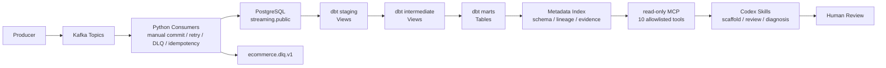
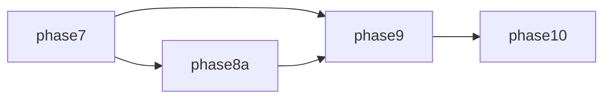

# Kafka Order Event Platform

這是一個 **local-first 的零售資料平台作品集與參考實作**：訂單與 application log 事件先經 Kafka
可靠寫入 PostgreSQL，再由 dbt 建立分析資料產品，最後以 Metadata、資料血緣（lineage）、唯讀 MCP
（read-only MCP）與 Codex Skills 支援資料工程開發和事故診斷。

它不是一般 CRUD 電商網站，也不只是 Kafka Producer／Consumer Demo。它把事件處理、分析建模、CI、
治理證據與 AI 協作放在同一條可在本機重現的流程中，但**不是 production-ready 平台，也不是會自動修改
正式環境的 AI Agent**。

## 60 秒理解這個專案

1. **Producer** 產生訂單與 application log 事件，依 `order_id` 或 `service` 作為 Kafka key。
2. **Kafka** 將事件保存在三個版本化 Topic，依 Partition 分配給 Consumer，永久錯誤另送 DLQ。
3. **Python Consumers** 驗證事件，執行 bounded retry、manual offset commit 與冪等性（idempotency）；
   PostgreSQL transaction 成功後才 commit Kafka offset。
4. **PostgreSQL** 的 `public` schema 保存訂單事件、處理標記與每分鐘 application log 聚合，作為穩定來源。
5. **dbt** 將來源整理成 staging、intermediate 與 marts；前兩層重用清洗與轉換邏輯，marts 提供有
   Contract、grain、owner、SLO 與測試的資料產品（data product）。
6. **Metadata Index** 從 dbt artifacts、quality、contract、cost、lag 與 benchmark evidence 建立可查詢的
   schema、lineage 與狀態索引。
7. **唯讀 MCP** 只開放 10 個 allowlisted metadata tools，回傳有大小、深度、timeout 與 evidence 邊界的結果。
8. **Codex Skills** 使用這些證據協助 dbt scaffold、PR review 與 Incident Diagnosis，但不執行 mutation。
9. **GitHub Actions** 在乾淨 runner 重建關鍵依賴並驗證 Phase 7 → 8A → 9 → 10；它是 CI，不是 deployment。

## 完整資料流



Kafka 到 PostgreSQL 採 **at-least-once + idempotency**：DB commit 與 Kafka offset commit 之間仍有
replay window，因此不宣稱 distributed exactly-once。Codex Skills 只產生草稿、review findings、診斷與
建議；commit、rerun、backfill、offset reset、schema／IAM 變更與 deployment 都停在 Human Review 邊界。

## 實際會建立哪些東西

| 層級 | 建立者 | 實際物件 | 用途 |
|---|---|---|---|
| Kafka | `scripts/create_topics.py` | `ecommerce.orders.raw.v1`、`ecommerce.application-logs.raw.v1`、`ecommerce.dlq.v1` | 訂單與 log 事件傳輸、永久錯誤隔離 |
| PostgreSQL `public` | Alembic + Consumers | `valid_orders`、`processed_events`、`log_metrics_minute` | 保存已處理訂單事件、冪等標記與 endpoint-minute log 聚合 |
| `analytics_local_staging` | dbt | `stg_order_events`、`stg_processed_events`、`stg_log_metrics_minute` Views | rename、cast、UTC／日期與欄位標準化 |
| `analytics_local_intermediate` | dbt | `int_order_event_sequence`、`int_order_latest_state`、`int_service_minute_metrics` Views | 訂單排序、latest known state 與共用指標邏輯 |
| `analytics_local_marts` | dbt | `fct_order_events`、`fct_orders`、`mart_daily_sales`、`mart_service_health` Tables | BI／分析使用的 contracted data products |
| `reports/metadata/` | Metadata builder／MCP | `metadata-index.json`、`lineage-graph.json`、`index-summary.json`、validation／smoke／security／audit reports | Schema、lineage、quality 與 MCP evidence |
| `reports/skills/` | Skills smoke／CI | scaffold、PR review、incident smoke 與 `phase10-ci-summary.json` | Codex Skills 的可機讀驗證證據 |
| `reports/incidents/` | Incident Diagnosis | `<incident_id>.json`、`<incident_id>.md` | 供人工 review 的事故診斷與處置計畫 |

`streaming` 是 PostgreSQL Database；`public` 與 `analytics_local_*` 是其中的 Schema。PostgreSQL **沒有**
保存 raw application-log rows，只有 `log_metrics_minute` 的 minute aggregate。

## dbt 分層模型

### staging：來源標準化

staging 只讀取三張 `public` source tables，負責欄位命名、型別轉換、UTC timestamp 與日期標準化，保留
來源 grain，不定義跨來源 business metrics。三個 staging models 都 materialize 為 View。

### intermediate：可重用轉換邏輯

- `int_order_event_sequence`：每個 `event_id` 一列，加入依 Kafka stream order 計算的事件序列。
- `int_order_latest_state`：每個 `order_id` 一列，表達目前事件集合的 latest known state。
- `int_service_minute_metrics`：每分鐘 × service × endpoint 一列，安全計算 rate。

三個 intermediate models 也是 View，方便檢查與重用，不直接作為 published data product。

### marts：對外分析資料產品

| Model | Grain | 語意邊界 |
|---|---|---|
| `fct_order_events` | 每筆 order `event_id` 一列 | 保留 event-level Kafka lineage，不捏造未儲存 payload 欄位 |
| `fct_orders` | 每個 `order_id` 一列 | latest known lifecycle state，不是財務最終結算 |
| `mart_daily_sales` | 每個 `event_date` × `currency` × `channel` 一列 | 不做 FX 換算；`paid_amount` 不是會計 revenue |
| `mart_service_health` | 每個 `metric_minute` × `service` 一列 | latency 使用加權平均，不做 average of averages |

四個 marts 都 materialize 為 Table，並具 enforced Contract、column descriptions、owner／SLO metadata
與測試。

### 為什麼 View 與 Table 這樣分工

View 儲存 SQL 定義，查詢時從目前來源計算結果；它適合本專案資料量下較輕的標準化與共用邏輯，也讓
新資料進入 `public` 後能在查詢 staging／intermediate 時反映來源變化。Table 儲存已計算結果，適合被
Dashboard／BI 重複查詢，但 marts 只代表最近一次 `dbt build` 的快照，要重新執行 `make dbt-build`
才會更新。

這是依目前用途、資料量、可讀性與本機可重現性做出的 materialization 選擇；不是「View 一定慢」或
「Table 一定快」，View 查詢也會使用資料庫資源。更完整的語意見
[Data Platform modeling](docs/data-platform/modeling.md)。

## GitHub Actions 在做什麼

[Data Platform CI workflow](.github/workflows/data-platform-ci.yml) 的觸發條件是 pull request、推送到
`main`，以及手動 `workflow_dispatch`。同一 Git ref 上的新 run 會取消仍在執行的舊 run。



- **Phase 7**：建立 PostgreSQL service 與 Kafka fixture path，執行 migration、fixtures、dbt scaffold／
  Contract scenarios、convention checks、state-based Slim CI 或明確 full-build fallback，以及 Python checks。
- **Phase 8A**：在獨立乾淨 runner 驗證 BigQuery compatibility metadata、partition／cost policy 與純本機
  orchestration contract；不呼叫 BigQuery 或 Airflow runtime。
- **Phase 9**：重新建立 PostgreSQL、Kafka、fixtures 與 dbt artifacts，產生 lag 和 Phase 7／8A evidence，
  再驗證 Metadata Index、lineage、唯讀 MCP smoke、安全邊界與 audit。
- **Phase 10**：再次建立所需 Phase 9 inputs，驗證三個 Codex Skills、Incident Diagnosis、lint、typecheck
  與完整 pytest regression。

每個主要 Job 都在新的 GitHub runner 執行，看不到開發者本機的 Docker volumes。Workflow 會上傳
run-specific、allowlisted reports／artifacts 供診斷，但**不部署 production**。

## Quick Start：逐層在本機測試

先準備 Python 3.14.6、pyenv／pyenv-virtualenv、Docker Compose，以及本機設定：

```bash
pyenv virtualenv 3.14.6 kafka_streaming  # 環境不存在時只需一次
pyenv activate kafka_streaming
python -m pip install -e . --group dev --group data-platform
cp .env.example .env
cp dbt/profiles.yml.example dbt/profiles.yml
```

Credentials 只能放在 ignored local files 或環境變數，不得 commit。

### 1. 啟動基礎環境

```bash
make up
make topics
make migrate
```

啟動 Kafka、PostgreSQL 與 Kafka UI，等待必要服務，建立三個 Topics，再套用 Alembic migrations。
這些指令不會主動刪除既有 volumes；可用 `docker compose ps`、`make list-topics` 和
`make describe-topics` 查看結果。

### 2. 建立測試資料

```bash
make data-platform-fixtures
make consumer-lag
```

Fixture loader 會啟動 Consumer、將 deterministic events 發到 Kafka，等待資料 durable 寫入
PostgreSQL，然後停止它啟動的 Consumer；重跑相同 run ID 會跳過既有 event IDs，不會 truncate tables
或 reset offsets。摘要寫到 `reports/data-quality/phase6-fixtures-latest.json`；`consumer-lag` 顯示兩個
Consumer Group 的 backlog 是否已消化。

### 3. 建立 dbt Models

```bash
make dbt-deps
make dbt-debug
make dbt-build
make dbt-source-freshness
make dbt-docs
```

依序安裝 dbt packages、驗證 PostgreSQL 連線、建立／更新 Views 與 Tables 並執行相關 tests、驗證
source freshness，最後在 `dbt/target/` 產生 `manifest.json`、`catalog.json` 等 dbt artifacts。

### 4. 建立 Metadata 與測試 MCP

```bash
make metadata-index
make metadata-validate
make mcp-smoke
```

這組指令從現有 dbt artifacts 與 allowlisted evidence 建立並驗證 `reports/metadata/`，再以 repository-local
STDIO child process 測試唯讀 MCP；不需要先在 ChatGPT 或 Codex MCP UI 註冊。

### 5. 執行 Phase 9／10 驗收

```bash
make phase9-ci
make phase10-ci
```

這是 Metadata／MCP 與 Skills／Incident Diagnosis 的本機 acceptance gates，不是 deployment 指令。
它們會新增或更新 ignored reports；執行前仍需先備妥各自所需的 dbt／metadata inputs。

### 6. 執行可靠性 Demo

```bash
make demo
```

Demo 會產生包含有效與 invalid events 的短 workload，驗證 DLQ、停止 Consumer 後 lag 上升、重啟後
lag 回落，以及 DB 已 commit 但 offset 未 commit 時的 replay／idempotency。它會新增測試事件並在
`reports/runs/` 寫入 run-specific report，但不刪除 volumes 或 reset consumer offsets。

完整逐步表格、5／15 分鐘展示與 clean-room 注意事項見
[Portfolio Demo Guide](docs/data-platform/portfolio-demo.md)。

## 資料新鮮度與更新方式

- Kafka Consumer 將新資料寫入 `streaming.public`。
- staging／intermediate 是 View，查詢時可反映最新的 `public` 來源。
- marts 是 Table，只代表最近一次 `make dbt-build` 的結果；新來源資料不會自動刷新 mart。
- `make dbt-source-freshness` 依 source 的 persisted timestamp 驗證新鮮度，本機長時間未執行不等同
  production pipeline failure。
- Metadata Index 若要反映最新模型與狀態，先重新產生相關 dbt artifacts／reports，再執行
  `make metadata-index` 與 `make metadata-validate`。

## Kafka 可靠性語意

| Topic | Partitions | RF | Key | 用途 |
|---|---:|---:|---|---|
| `ecommerce.orders.raw.v1` | 6 | 1 | `order_id` | 訂單／付款事件 |
| `ecommerce.application-logs.raw.v1` | 6 | 1 | `service` | Application logs |
| `ecommerce.dlq.v1` | 3 | 1 | `event_id` 或來源座標 | 永久錯誤 |

Order processing 的關鍵順序是：

```text
poll → decode/validate → begin DB transaction
→ write processed_events + valid_orders → commit DB → commit Kafka offset
```

Consumer 關閉 automatic offset commit／storage。DB failure 不會推進 offset；若 process 在 DB commit 後、
Kafka commit 前停止，`(consumer_group, event_id)` 冪等鍵與同 transaction 的 business write 讓 replay
不重複建立資料。Transient failure 最多 retry 三次，預設 backoff 為 1／2／4 秒；permanent decode／
validation error 只有在 DLQ delivery 成功後才 commit 原 offset。RF=1 只適合本機，沒有 multi-replica durability。

## 安全邊界

- MCP 只暴露 10 個固定的 read-only tools，不接受 arbitrary SQL、shell、URL、path 或 filesystem mutation。
- Pydantic schema 拒絕 extra fields 與 SQL-shaped input；lineage depth、node count、response size 與 timeout
  都有上限。
- Responses 與 JSONL audit 會 redaction secret-shaped keys、bearer tokens 和 connection strings；audit
  只記 sanitized metadata，不記 environment dump。
- Incident Diagnosis 只產生 facts、inferences、unknowns、建議、backfill／validation plans，從不執行它們。
- 系統不會自動 reset offsets、backfill、deploy、修改 Schema／IAM、建立 cloud resources 或 merge PR。
- 缺少、過期或無效 evidence 會得到 degraded／not_available 結果，最終處置仍需 Human Review。

## Phase 狀態

| Phase | Scope | Status |
|---|---|---|
| Phase 1–5 | Kafka Event Processing Core | Accepted |
| Phase 6 | dbt PostgreSQL Data Products | Accepted |
| Phase 7 | Paved Road and Slim CI | Accepted |
| Phase 8A | Local BigQuery Compatibility and Cost Policy | Accepted |
| Phase 8B | BigQuery Sandbox Validation | Optional／Not executed |
| Phase 8C | Full BigQuery Pipeline | Optional／Deferred |
| Phase 9 | Metadata Index and Read-only MCP | Accepted |
| Phase 10 | Codex Skills and Incident Diagnosis | Accepted |

Mandatory local portfolio mainline（Phase 6 → 7 → 8A → 9 → 10）已完成。Phase 8A 只有
`static_validation` 與 `simulated` evidence；沒有 Sandbox 或 Billing-enabled BigQuery execution。

## Local benchmark evidence

Measured environment: macOS 24.6.0, Intel Core i9-9880H, 16 logical cores, 64 GiB host memory,
Docker Desktop 29.6.1 (VM-visible 16 CPUs and about 15.6 GiB memory), Python 3.14.6, Kafka 4.1.0,
PostgreSQL 16. Docker Desktop's configured resource ceiling was not reliably observable and is
recorded as unavailable.

| Run | Produced | Actual producer EPS | Delivery avg / P95 / P99 | Observed max / final lag | Durable runtime | Status |
|---|---:|---:|---:|---:|---:|---|
| Smoke | 6,000 | 99.99 | 10.07 / 11.86 / 12.31 ms | 90 / 0 | 61.58 s | passed |
| Standard | 300,000 | 999.55 | 5.78 / 7.54 / 8.22 ms | 34,381 / 0 | 697.52 s | passed |
| Stress original | 1,500,000 | 4,983.86 | 4.64 / 6.67 / 7.85 ms | unavailable | not completed | failed |
| Stress adjusted (1,000 EPS / 60 s) | 60,000 | 999.67 | 5.37 / 7.15 / 8.07 ms | 7,886 / 0 | 142.73 s | passed |

The original Stress producer delivered all records, but only 1,209,387 of 1,500,000 were committed
before the bounded drain timeout. The failed report is retained rather than recast as capacity.
`producer_delivery_latency_ms` measures local produce attempt to Kafka delivery callback; it is not
end-to-end latency. These host-specific results cannot be extrapolated to production capacity.

- [Smoke report](reports/runs/benchmark-smoke-20260805T094857116796Z-39268c85-e8f3-485d-ae3c-087b407499ac.json)
- [Standard report](reports/runs/benchmark-standard-20260805T095019746379Z-456dade3-07c5-4994-b1a1-7f9ad3c37b96.json)
- [Original Stress failed report](reports/runs/benchmark-stress-20260805T100330400923Z-e27d4bce-7675-4208-bf10-da205e87e054.json)
- [Adjusted Stress report](reports/runs/benchmark-stress-20260805T102059023444Z-8d8642fe-0e3e-4ee4-ad14-16c70ab91db4.json)

詳見 [benchmark method and schema](docs/benchmark.md)。

## 重要限制

- 單節點 combined KRaft Kafka 與 local PostgreSQL 不代表 production 的 availability、durability、security、
  backup、disaster recovery 或 capacity。
- Phase 8A 不使用 BigQuery parser、optimizer、dry-run API 或 runtime；Phase 8B／8C 沒有完成，也沒有真實
  job ID、bytes、`MERGE`、incremental、Cloud Composer、Billing 或 cost evidence。
- PostgreSQL 沒有 raw application logs、payment method、failure／cancellation reason、refund、FX 或 settlement
  data，因此 models 不宣稱具備這些語意。
- Metadata Index 是 artifact-based local harness，不是 live enterprise observability／governance platform。
- dbt parse／compile success 不證明 metric semantics 或 business correctness；AI suggestion 也仍需人工 review。
- 本專案不宣稱 distributed exactly-once、enterprise governance、autonomous remediation 或 production readiness。

## 文件導覽

- [Data Platform 文件首頁](docs/data-platform/README.md)：依 Kafka、dbt、CI、Metadata／MCP／Skills 與本機操作需求選擇閱讀路徑。
- [Data Platform architecture](docs/data-platform/architecture.md)：Database／Schema／relation、完整資料流與 CI 架構。
- [Modeling semantics](docs/data-platform/modeling.md)：grain、money、latest state、weighted average 與 materialization。
- [Data quality](docs/data-platform/quality.md)：tests、freshness、Contract 與 evidence rules。
- [Portfolio demo](docs/data-platform/portfolio-demo.md)：5／15 分鐘 Demo、逐步本機驗證與安全清理。
- [Interview guide](docs/data-platform/interview-guide.md)：面試說法、工程決策與誠實限制。
- [Phase 6](docs/data-platform/phase-6.md)／[Phase 7](docs/data-platform/phase-7.md)／[Phase 8A](docs/data-platform/phase-8a.md)／[Phase 9](docs/data-platform/phase-9.md)／[Phase 10](docs/data-platform/phase-10.md)：各 Phase runbook 與 acceptance boundary。
- [Kafka architecture](docs/architecture.md)／[reliability](docs/reliability.md)／[demo](docs/demo.md)：Kafka Core 的設計與可靠性細節。
- [Kafka Core specification](SPEC.md)／[Data Platform specification](DATA_PLATFORM_SPEC.md)：功能範圍與驗收權威。
