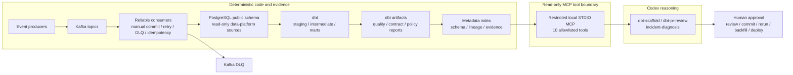

# Kafka Order Event Platform

## Project overview

這是一個從 Kafka Event Processing Core 延伸到 Analytics Data Platform 與 AI Harness 的作品集。
核心設計是 **local-first**、**deterministic-before-generative**、**read-only-by-default**：先以
Kafka、PostgreSQL、dbt 與 deterministic validators 建立可重現證據，再讓 Codex Skills 透過受限制的
MCP metadata surface 做 scaffold、review 與 incident diagnosis。

主要技術包含 Python 3.14.6、Kafka、PostgreSQL、dbt、GitHub Actions、machine-readable metadata、
STDIO MCP 與 repository-local Codex Skills。本專案用於工程能力展示，不是 production-ready 系統。

## What this project demonstrates

- Kafka at-least-once processing、manual offset commit、database idempotency、bounded retry 與 DLQ
- PostgreSQL transaction boundary，以及 DB 成功後才 commit Kafka offset 的可靠性語意
- dbt sources → staging → intermediate → marts 分層、明確 grain 與 multi-currency safety
- Enforced data contracts、source/data/unit tests、freshness、owner 與 SLO metadata
- dbt Paved Road：draft scaffold、convention validation、contract diff 與 state-based Slim CI
- BigQuery-compatible metadata、partition-filter 與 cost policies；證據僅為 local static/simulated
- dbt artifacts 驅動的 metadata index、schema discovery、quality 與 bounded lineage
- Fail-closed、10-tool、read-only STDIO MCP；具 timeout、validation、redaction 與 audit
- Evidence-based incident diagnosis，明確區分 facts、inferences、unknowns 與 rejected hypotheses
- Human approval boundary：AI 只提出 code 或 remediation/backfill/validation plans，不執行 mutation

## Architecture



The deterministic layer owns validation and evidence. MCP exposes bounded metadata queries only.
Codex organizes evidence and proposes changes; a human remains responsible for every mutating action.
Detailed boundaries are in the [data-platform architecture](docs/data-platform/architecture.md).

## Phase status

| Phase | Scope | Status |
|---|---|---|
| Phase 1–5 | Kafka Event Processing Core | Accepted |
| Phase 6 | dbt PostgreSQL Data Products | Accepted |
| Phase 7 | Paved Road and Slim CI | Accepted |
| Phase 8A | Local BigQuery Compatibility and Cost Policy | Accepted |
| Phase 8B | BigQuery Sandbox Validation | Optional / Not executed |
| Phase 8C | Full BigQuery Pipeline | Deferred |
| Phase 9 | Metadata Index and Read-only MCP | Accepted |
| Phase 10 | Codex Skills and Incident Diagnosis | Accepted |

**Mandatory portfolio mainline: Completed.** Phase 8B and 8C are not prerequisites for that local
mainline and have not been executed.

## Quick start

Prerequisites: Python 3.14.6, pyenv/pyenv-virtualenv, Docker with Compose, and the repository-local
configuration shown below. Credentials belong in ignored local files or environment variables and
must never be committed.

```bash
pyenv virtualenv 3.14.6 kafka_streaming  # once, if the environment does not exist
pyenv activate kafka_streaming
python -m pip install -e . --group dev --group data-platform
cp .env.example .env
cp dbt/profiles.yml.example dbt/profiles.yml

make up
make topics
make migrate
make data-platform-fixtures
make dbt-deps
make dbt-build
make dbt-source-freshness
```

The fixture loader is rerunnable: it uses the real Kafka consumers, does not truncate source tables,
and does not reset offsets. dbt reads `public` and writes only to isolated `analytics_*` schemas.
See the [portfolio demo guide](docs/data-platform/portfolio-demo.md) for expected results and cleanup.

## Demo paths

### Five-minute demo

After the quick start:

```bash
make dbt-docs
make metadata-index
make mcp-smoke
make skill-dbt-pr-review-smoke
make incident-demo
```

Show the mart grain/contracts in `dbt/models/marts/marts.yml`, the fixed MCP tool list, and the
generated incident report. The incident result may be degraded when optional or current operational
evidence is unavailable; that is an intentional safe outcome, not a fabricated success.

### Data engineering demo

```bash
make dbt-build
make dbt-source-freshness
make dbt-validate-conventions
make dbt-contract-check
make dbt-slim-ci-local
```

This path demonstrates layered lineage, contracts/tests, currency-safe mart grains, a controlled
breaking-contract fixture, and native `state:modified+ --defer` selection with explicit full-build
fallback.

### AI harness demo

```bash
make metadata-index
make mcp-smoke
make skill-dbt-scaffold-smoke
make skill-dbt-pr-review-smoke
make skill-incident-diagnosis-smoke
make incident-demo
```

The scaffold verifies columns through MCP before generating into temporary projects; the reviewer
emits deterministic severities; incident diagnosis separates evidence classes and always reports
`mutation_executed=false`.

For a narrated 5- and 15-minute sequence plus safe failure demonstrations, use the
[portfolio demo guide](docs/data-platform/portfolio-demo.md). For interview talking points, use the
[interview guide](docs/data-platform/interview-guide.md).

## Kafka reliability semantics

### Topics and routing

| Topic | Partitions | RF | Key | Purpose |
|---|---:|---:|---|---|
| `ecommerce.orders.raw.v1` | 6 | 1 | `order_id` | Order/payment events |
| `ecommerce.application-logs.raw.v1` | 6 | 1 | `service` | Application logs |
| `ecommerce.dlq.v1` | 3 | 1 | `event_id` or source coordinate | Permanent errors |

Consumer groups are `order-processing-group-v1` and `application-log-processing-group-v1`. A key
preserves order only within one partition. RF=1 is a local-development choice and provides neither
broker failover nor multi-replica durability.

### Commit, idempotency, retry, and DLQ

Order processing follows:

```text
poll → decode/validate → begin DB transaction
→ write processed_events + valid_orders → commit DB → commit Kafka offset
```

Consumers disable automatic offset commit and storage. A DB failure does not advance the offset.
If the process stops after DB commit but before Kafka commit, replay is safe because
`(consumer_group, event_id)` is the idempotency key and the marker/business write share one
transaction. This is at-least-once plus idempotency, not distributed exactly-once.

Transient DB/Kafka failures retry at most three times with default 1/2/4-second backoff. Permanent
decode/validation errors go to the DLQ, and the original offset advances only after confirmed DLQ
delivery. The log consumer persists minute aggregates and commits only durable contiguous offsets.

## Data products and governance

dbt reads the real `public.valid_orders`, `public.processed_events`, and
`public.log_metrics_minute` tables. PostgreSQL stores no raw application-log rows. Published models:

| Model | Grain | Important semantic boundary |
|---|---|---|
| `fct_order_events` | one row per order event ID | Event-level lineage; no invented payload fields |
| `fct_orders` | one row per order ID | Latest known event state, not financial settlement |
| `mart_daily_sales` | one row per event date, currency, channel | No FX conversion; paid amount is not accounting revenue |
| `mart_service_health` | one row per minute, service | Weighted latency from sums, not average-of-averages |

All published marts have contracts, descriptions, owner/SLO metadata and tests. `dbt compile` proves
syntactic/model resolution only; it does not prove business correctness.

## Evidence and validation map

| Evidence | Repository location | Interpretation |
|---|---|---|
| Functional authority | [Kafka Core spec](SPEC.md), [Data Platform spec](DATA_PLATFORM_SPEC.md) | Scope, non-goals, acceptance rules |
| Architecture/modeling/quality | [architecture](docs/data-platform/architecture.md), [modeling](docs/data-platform/modeling.md), [quality](docs/data-platform/quality.md) | As-built semantics and constraints |
| Phase runbooks | [Phase 6](docs/data-platform/phase-6.md), [Phase 7](docs/data-platform/phase-7.md), [Phase 8A](docs/data-platform/phase-8a.md), [Phase 9](docs/data-platform/phase-9.md), [Phase 10](docs/data-platform/phase-10.md) | Reproduction commands and evidence boundaries |
| CI | [Data Platform workflow](.github/workflows/data-platform-ci.yml) | Phase 7 → 8A → 9 → 10 jobs and uploaded diagnostics |
| Tests | [Kafka tests](tests), [Data Platform tests](tests/data_platform) | Unit, integration, E2E, policy, MCP and Skill coverage |
| Make targets | [Makefile](Makefile) | Supported local command surface |
| Report schemas | [metadata models](src/data_platform/metadata_models.py), [incident models](src/data_platform/incidents.py), [Phase 8A common schema](src/data_platform/phase8a_common.py) | Pydantic/deterministic machine-readable contracts |
| Local benchmark evidence | [committed benchmark reports](reports/runs) | Host-specific measured evidence only |

dbt artifacts are generated under `dbt/target/`. Quality, cost, metadata, audit, Skill, and incident
reports are generated locally under `reports/...` and intentionally ignored by Git, except for the
explicitly allowlisted benchmark evidence. GitHub Actions uploads bounded run-specific diagnostics;
the workflow file alone is not execution evidence.

## Local benchmark evidence

Measured environment: macOS 24.6.0, Intel Core i9-9880H, 16 logical cores, 64 GiB host memory,
Docker Desktop 29.6.1 (VM-visible 16 CPUs and about 15.6 GiB memory), Python 3.14.6, Kafka 4.1.0,
PostgreSQL 16. Docker Desktop's configured resource ceiling was not reliably observable and is
recorded as unavailable.

| Run | Produced | Actual producer EPS | Delivery avg / P95 / P99 | Observed max / final lag | Durable runtime | Status |
|---|---:|---:|---:|---:|---:|---|
| Smoke | 6,000 | 99.99 | 10.07 / 11.86 / 12.31 ms | 90 / 0 | 61.58 s | passed |
| Standard | 300,000 | 999.55 | 5.78 / 7.54 / 8.22 ms | 34,381 / 0 | 697.52 s | passed |
| Stress original | 1,500,000 | 4,983.86 | 4.64 / 6.67 / 7.85 ms | unavailable | not completed | failed |
| Stress adjusted (1,000 EPS / 60 s) | 60,000 | 999.67 | 5.37 / 7.15 / 8.07 ms | 7,886 / 0 | 142.73 s | passed |

The original Stress producer delivered all records, but only 1,209,387 of 1,500,000 were committed
before the bounded drain timeout. The failed report is retained rather than recast as capacity.
`producer_delivery_latency_ms` measures local produce attempt to Kafka delivery callback; it is not
end-to-end latency. These host-specific results cannot be extrapolated to production capacity.

- [Smoke report](reports/runs/benchmark-smoke-20260805T094857116796Z-39268c85-e8f3-485d-ae3c-087b407499ac.json)
- [Standard report](reports/runs/benchmark-standard-20260805T095019746379Z-456dade3-07c5-4994-b1a1-7f9ad3c37b96.json)
- [Original Stress failed report](reports/runs/benchmark-stress-20260805T100330400923Z-e27d4bce-7675-4208-bf10-da205e87e054.json)
- [Adjusted Stress report](reports/runs/benchmark-stress-20260805T102059023444Z-8d8642fe-0e3e-4ee4-ad14-16c70ab91db4.json)

See the [benchmark method and schema](docs/benchmark.md) for coordinate isolation, lag, percentile,
and failure semantics.

## Important limitations

- Local PostgreSQL and single-node combined KRaft Kafka do not represent production capacity,
  availability, durability, security, backup, or disaster recovery.
- Phase 8A validates BigQuery-compatible metadata and local policy only. It uses static checks and
  simulated fixtures, not the BigQuery parser, optimizer, dry-run API, or runtime.
- Phase 8B was not executed. No Sandbox-observed job or bytes evidence exists.
- Phase 8C was not executed. No real BigQuery load, DML, `MERGE`, incremental model, partition,
  clustering, Cloud Composer, billing, or cost evidence exists.
- Incident diagnosis is read-only and never reruns pipelines, backfills data, resets offsets,
  mutates schemas, deploys code, changes IAM, or acknowledges an incident.
- AI-generated or suggested SQL and remediation plans require human review.
- dbt parse/compile success does not prove metric semantics or business correctness.
- The local metadata index is artifact-based, not a live enterprise observability or governance
  platform. Stale or missing evidence produces degraded results.
- The project does not claim exactly-once across Kafka/PostgreSQL, enterprise governance,
  autonomous remediation, or production readiness.

## Further reading

- [Portfolio demo](docs/data-platform/portfolio-demo.md)
- [Interview guide](docs/data-platform/interview-guide.md)
- [Kafka architecture](docs/architecture.md)
- [Kafka reliability](docs/reliability.md)
- [Kafka demo](docs/demo.md)
- [Data Platform architecture](docs/data-platform/architecture.md)
- [Phase 10 Skills and incident diagnosis](docs/data-platform/phase-10.md)
