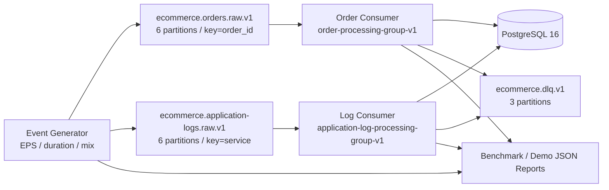

# Kafka 即時訂單事件與應用日誌平台

這是一個可在本機重複執行的 Kafka MVP，用來展示事件產生、manual offset commit、PostgreSQL
transaction、idempotent consumer、bounded retry、DLQ、每分鐘日誌聚合、Consumer Lag、故障恢復與實測
benchmark。它是一個作品集與面試展示專案，不是 production-ready 系統。

Phase 6 已在既有 PostgreSQL sources 上加入本機 dbt data products、contracts、data/unit tests、freshness
與 generated docs。Phase 7 的 draft scaffold、deterministic convention/contract checks與dbt state-based
Slim CI已由指定commit的GitHub Actions run接受。Phase 8A加入本機BigQuery compatibility metadata、
partition/cluster/SQL policies、fixture cost guardrails與純Python orchestration contract；它沒有執行
BigQuery，也不是BigQuery runtime acceptance。Phase 9新增deterministic metadata/lineage index與本機
read-only STDIO MCP tools；缺少Sandbox、Cloud或Airflow evidence會明確回傳`not_available`。
Phase 10新增三個repository-local Codex Skills與唯讀、evidence-based incident diagnosis；它透過Phase 9
restricted STDIO adapter查證，不提供autonomous production mutation、pipeline rerun或Kafka offset reset。

## 解決的問題

平台同時處理兩類資料：需要逐筆可靠落地的訂單事件，以及需要依 event time 聚合的 API access logs。
Kafka offset 與 PostgreSQL transaction 分屬不同系統；本專案以 at-least-once processing、manual
commit 與資料庫 idempotency 安全處理 replay，不宣稱跨 Kafka/PostgreSQL exactly-once。

## 架構



## 技術棧

- Python 3.14.6、pyenv virtualenv `kafka_streaming`
- Apache Kafka 4.1.0，單節點 combined KRaft mode
- PostgreSQL 16、Kafka UI
- confluent-kafka、Pydantic 2、pydantic-settings
- SQLAlchemy 2、Alembic、psycopg
- dbt-core 1.12、dbt-postgres 1.11（獨立 `data-platform` dependency group）
- pytest、Ruff、mypy、Docker Compose

## Repository structure

```text
apps/                  executable composition roots
src/streaming_platform reusable models, Kafka/DB services, consumers and benchmark logic
migrations/            Alembic schema migration
scripts/               topic bootstrap, readiness, lag and Kafka smoke tools
dbt/                   PostgreSQL source, staging, intermediate and mart models
src/data_platform/     deterministic Phase 6 fixture support
.agents/skills/         Phase 10 dbt scaffold/review與incident diagnosis Skills
apps/incident_agent/    唯讀incident workflow composition root
tests/unit/             isolated deterministic logic
tests/integration/      real Kafka/PostgreSQL integration behavior
tests/e2e/              executable process and recovery flows
tests/data_platform/    Phase 6 unit and local integration coverage
docs/data-platform/     Phase 6 architecture, modeling, quality and runbook
docs/                   Kafka architecture, reliability, benchmark and demo details
reports/runs/           timestamped machine-readable reports
```

## Topic、Partition 與 Message Key

| Topic | Partitions | RF | Key | 用途 |
|---|---:|---:|---|---|
| `ecommerce.orders.raw.v1` | 6 | 1 | `order_id` | 訂單與付款事件 |
| `ecommerce.application-logs.raw.v1` | 6 | 1 | `service` | API 與應用程式日誌 |
| `ecommerce.dlq.v1` | 3 | 1 | `event_id`，無法解析時使用source coordinate | 永久錯誤 |

6個source partitions讓consumer group最多有6個有效並行instances。Order key保留同一order在同一partition
內的順序；Log key讓同一service穩定路由。Kafka只保證單一partition內的順序。RF=1符合本機單broker，
不提供正式環境高可用。

Consumer groups固定為：

- `order-processing-group-v1`
- `application-log-processing-group-v1`

## Event schema

每個事件都有相同envelope：

```json
{
  "event_id": "f2a89c11-5ef2-41df-a337-3c44902b2340",
  "event_type": "order_created",
  "event_version": 1,
  "event_time": "2026-08-05T10:00:00Z",
  "source": "order-api",
  "payload": {
    "order_id": "ORD-100001",
    "user_id": "USR-1001",
    "product_id": "PRD-501",
    "quantity": 2,
    "amount": "1800.00",
    "currency": "TWD",
    "channel": "web"
  }
}
```

支援4種Order events與2種Log events，各自使用獨立Pydantic payload model。Datetime必須timezone-aware並
正規化為UTC；money使用`Decimal`。Duplicate injection故意重用原event ID，新benchmark run預設由
run ID導出不同seed，避免跨run ID collision。

## PostgreSQL model

- `valid_orders`：合法Order business rows，包含Kafka source coordinates。
- `processed_events`：`(consumer_group, event_id)` composite primary key，也是idempotency marker。
- `log_metrics_minute`：`(metric_minute, service, endpoint)` minute aggregate。

`processed_events`與business write在同一transaction。Log average不另存欄位，而由
`response_time_sum_ms / request_count`查詢時計算。

## 環境需求與Python設定

- pyenv、pyenv-virtualenv
- Python 3.14.6 virtualenv `kafka_streaming`
- Docker Desktop或相容Docker Compose環境
- 可用ports：29092、5432、8080

```bash
pyenv install 3.14.6
pyenv virtualenv 3.14.6 kafka_streaming
pyenv local kafka_streaming
python --version
pyenv version
python -c "import sys; print(sys.executable)"
python -m pip install -e . --group dev --group data-platform
cp .env.example .env
cp dbt/profiles.yml.example dbt/profiles.yml
```

Repository的`.python-version`已指定`kafka_streaming`；共享程式碼沒有寫死使用者的Python路徑。

## 快速啟動

```bash
make up
make topics
make migrate
make order-consumer   # terminal A
make log-consumer     # terminal B
make generate-smoke  # terminal C
make consumer-lag
```

Kafka UI位於 <http://localhost:8080>。`make topics`與`make migrate`都可安全重跑。

## Makefile commands

| Command | 用途 |
|---|---|
| `make up/down/restart/logs` | 管理本機infra；`down`保留volumes |
| `make topics/list-topics/describe-topics` | 建立與檢查topics |
| `make smoke-kafka` | 真實Kafka key/value round trip |
| `make migrate` | Alembic upgrade |
| `make order-consumer/log-consumer` | 啟動正式consumers |
| `make generate-smoke/standard/stress` | Producer-only presets |
| `make inject-bad-events` | 產生schema-invalid records |
| `make consumer-lag` | Human-readable真實Kafka lag |
| `make consumer-lag FORMAT=json` | Machine-readable lag |
| `make benchmark` | Smoke benchmark |
| `make benchmark-standard/benchmark-stress` | Standard／Stress profile |
| `make demo` | Mixed、DLQ、lag recovery與uncommitted replay |
| `make lint/typecheck/test` | 品質與完整tests |
| `make data-platform-fixtures` | 經既有Kafka consumers載入可安全重跑的Phase 6 fixtures |
| `make dbt-deps/debug/parse/compile` | 安裝與靜態驗證本機dbt project |
| `make dbt-build/dbt-test/dbt-source-freshness` | 建置並驗證PostgreSQL data products |
| `make dbt-docs` | 產生忽略於Git的dbt文件artifacts |
| `make test-data-platform` | 執行Phase 6 Python unit/integration tests |
| `make dbt-scaffold-smoke` | 在temporary directory驗證draft scaffold與no-overwrite行為 |
| `make dbt-validate-conventions` | 從fresh manifest驗證layer、metadata、docs與SQL conventions |
| `make dbt-contract-check` | 驗證pass與blocking contract-change scenarios |
| `make dbt-slim-ci-local` | 驗證modified+／defer selection與明示full fallback |
| `make bigquery-static-validate/bigquery-partition-policy` | 從fresh manifest驗證Phase 8A本機政策 |
| `make bigquery-cost-policy/bigquery-cost-report` | 評估固定fixture並明確標示simulated |
| `make test-bigquery-policy` | 執行metadata、SQL、cost、provider與policy-diff tests |
| `make phase8a-orchestration-validate` | 驗證Airflow runtime為not_available時的本機orchestration contract |
| `make data-platform-phase8a-local` | 產生run-specific Phase 8A reports與summary |
| `make metadata-index/metadata-validate` | 建立並驗證deterministic Phase 9 index與lineage |
| `make mcp-server/mcp-smoke/test-mcp` | 啟動本機STDIO server並驗證唯讀tools、安全與audit |
| `make validate-phase9/phase9-ci` | 重跑Phase 9本機completion path |
| `make skill-dbt-scaffold-smoke` | 以真實STDIO metadata在temporary output驗證原子、deterministic scaffold |
| `make skill-dbt-pr-review-smoke` | 驗證normal、warning/degraded與blocking deterministic findings |
| `make skill-incident-diagnosis-smoke` | 驗證四種fixture-based incident scenarios（simulated） |
| `make incident-demo` | 經Phase 9 restricted STDIO執行唯讀本機incident demo |
| `make test-skills/phase10-ci` | 執行Phase 10 unit、transport integration與local CI gate |

## Phase 6 dbt data products

dbt唯讀使用`public.valid_orders`、`public.processed_events`與`public.log_metrics_minute`。Models分為
staging、intermediate與marts，預設分別寫入`analytics_local_staging`、
`analytics_local_intermediate`與`analytics_local_marts`，不會寫入`public`。

```bash
make data-platform-fixtures
make dbt-deps
make dbt-debug
make dbt-build
make dbt-source-freshness
make dbt-docs
make test-data-platform
```

Order lifecycle依Kafka partition/offset決定latest known state；它不是財務最終結算狀態。Daily sales依
currency分組且沒有FX conversion。Service health以response-time sum除以request count計算weighted
average，沒有直接平均endpoint averages。PostgreSQL沒有raw application-log rows，因此無法提供request、
client IP或individual latency analytics。完整定義見[Phase 6 runbook](docs/data-platform/phase-6.md)、
[modeling semantics](docs/data-platform/modeling.md)與[data quality](docs/data-platform/quality.md)。

## Phase 7 paved road

Model scaffold會正規化`stg_`、`int_`或`mart_`prefix，拒絕覆寫任何既有SQL/YAML，且在不知道
columns或upstream時只產生帶`BLOCKING_TODO`的draft。Convention validator會阻擋未完成draft、缺少
mart grain/owner/SLO/contract/column docs、錯誤direct source使用與published wildcard。Contract checker
比較previous/current manifest，確定的breaking change會non-zero，無法從artifact判定的semantic change
則標示manual review。

Local Slim CI在隔離`analytics_ci_*`schemas建立base relations，再以dbt原生
`state:modified+ --defer --state`建置current modified models與downstream。無previous state時明確執行
full build fallback。詳細操作見[Phase 7 runbook](docs/data-platform/phase-7.md)。Commit `6e694ad`的
GitHub Actions `phase7` job與artifact已成功觀察，因此Phase 7已accepted。

## Phase 8A local compatibility and cost policy

四個published models宣告BigQuery status為`planned`。Fresh-manifest validator通過後，report才計算
`effective_status: static_validated`。Partitioned models強制bounded partition predicates；`fct_orders`
使用有期限的non-partitioned exemption。SQL lexer會將現有PostgreSQL-only syntax列為warning，不會因此
改寫Phase 6 grain、metrics、currency或lifecycle語意。

Cost reports只使用固定fixture，`evidence_level=simulated`、
`estimation_method=fixture_estimated`且`observed_job_id=null`。Sandbox／Cloud providers在本階段回傳
`not_available`，不會fallback成fixture。完整限制與commands見
[Phase 8A runbook](docs/data-platform/phase-8a.md)。No GCP credentials were used. No Billing account was
required. No BigQuery query or dry run was executed. Fixture estimates are not BigQuery optimizer
results.

## Phase 9 metadata and MCP

Phase 9只讀取allowlisted dbt與machine-readable reports，產生忽略於Git的
`reports/metadata/metadata-index.json`、`lineage-graph.json`與`index-summary.json`。十個MCP tools支援
asset搜尋、schema/owner、bounded lineage/impact、quality、pipeline failures、consumer lag與cost evidence。
所有input/output都有Pydantic schema；response受timeout與size限制，secret會redact，call會寫入sanitized
JSONL audit。Server只使用STDIO，不建立public listener，也不提供SQL、shell、filesystem write、pipeline
rerun、schema mutation或offset reset。

```bash
make metadata-index
make metadata-validate
make mcp-smoke
make test-mcp
```

若catalog、freshness、lag或optional report缺少，index/tool會列出`degraded`或`not_available`，不會捏造
空成功。Phase 8A cost fixture只可回`simulated`；Phase 8B/8C尚未開始，因此Sandbox/Cloud evidence不可用。
Codex設定、schema、exit codes、CI與SDK相容性決策見
[Phase 9 runbook](docs/data-platform/phase-9.md)。Phase 9已accepted。

## Phase 10 Codex Skills and incident diagnosis

Repository-local Skills位於`.agents/skills/dbt-scaffold`、`.agents/skills/dbt-pr-review`與
`.agents/skills/incident-diagnosis`。Scaffold先經Phase 9 metadata驗證真實columns，拒絕fake source、
missing column、path traversal與overwrite，再原子產生SQL/YAML/tests。PR review以deterministic rules優先，
contract column removal/type change固定為blocking；baseline或lineage缺失會標示degraded，不會被當成安全。

Incident workflow會實際啟動既有Phase 9 restricted STDIO server並執行`initialize`、`tools/list`、
`tools/call`。它區分confirmed facts、hypotheses、unknowns與rejected hypotheses，並分類
`static_validation`、`simulated`、`local_execution`、`sandbox_observed`、`cloud_observed`與
`not_available` evidence。Phase 8B/8C未完成時cloud evidence unavailable不是cloud failure，也不阻擋
本機Phase 10。沒有public MCP server、付費API或OpenAI API key需求。

Sample prompts：

- `Use $dbt-scaffold to create a mart from verified order metadata with grain one row per order_id.`
- `Use $dbt-pr-review to review these dbt changes for contracts, grain, tests, lineage, and cost risks.`
- `Use $incident-diagnosis to investigate this freshness alert and produce a read-only evidence report.`

第一版只query、inspect、correlate、analyze、summarize與產生供人工review的remediation/backfill/validation
plans。它不會自動改schema/data/IAM、rerun pipeline、reset Kafka offsets、merge/deploy或acknowledge
production incident。完整操作、fixtures、report schema與限制見
[Phase 10 runbook](docs/data-platform/phase-10.md)。本專案不是production-ready，也不是production
autonomous agent。

## Demo

`make demo`不會清表、reset offsets或刪除volumes，因此可從既有環境執行，也能在使用者明確執行
`docker compose down -v`後從乾淨狀態開始。流程包含：

```text
readiness → topics → migration → consumers → mixed events
→ DB/DLQ/lag驗證 → stop consumers → produce while stopped
→ lag rises → restart → lag returns to zero
→ deterministic DB-commit-before-offset-commit replay → cleanup → JSON report
```

Failure demo中的SIGTERM是「真實consumer process停止」，uncommitted window則是刻意省略Kafka commit的
可重現simulation。它們不是Kafka/PostgreSQL container failure。

## Consumer Lag

`make consumer-lag`使用confluent-kafka API讀取真實committed offset與partition log-end offset，而不是
使用DB row count。每個partition顯示：

```text
Consumer Group / Topic / Partition / Current Offset / Log End Offset / Lag / Status
```

Missing group或尚未commit的partition顯示`not_available`；topic不存在或Kafka無法連線時回傳非0。
Lag不會被clamp成假的0。

## Benchmark方法

| Profile | 原始目標 |
|---|---:|
| Smoke | 100 EPS / 60 seconds |
| Standard | 1,000 EPS / 300 seconds |
| Stress | 5,000 EPS / 300 seconds |

CLI與`BENCHMARK_*`環境變數可覆寫EPS、duration、order/log ratio、application error ratio、invalid、
duplicate、seed、poll interval與timeout。Benchmark預設使用20% Order、80% `api_access_log`、0% error
log／invalid／duplicate，量測主要persistence與aggregation路徑；`make demo`另外量測mixed DLQ與duplicate。

每次run使用唯一run ID和filename。Producer callback保存本次精確`topic/partition/offset` intervals；DB與
DLQ統計以這些coordinates隔離，不使用全表差值。既有backlog必須先在bounded timeout內排空，runner
不會reset consumer offsets。

Latency正式命名為`producer_delivery_latency_ms`：從第一次local produce attempt至成功Kafka delivery
callback，包含local queue backoff。這是producer-side acknowledgement latency，不是end-to-end latency。
P95/P99採nearest-rank。`end_to_end_latency_ms`目前為`not_implemented`且數值為`null`。

詳細定義與report schema見[Benchmark文件](docs/benchmark.md)。

## 實際Benchmark結果

量測環境：macOS 24.6.0、Intel Core i9-9880H、16 logical cores、64 GiB host memory、Docker Desktop
29.6.1（VM可見16 CPUs、約15.6 GiB memory）、Python 3.14.6、Kafka 4.1.0、PostgreSQL 16。
Docker Desktop UI設定的資源上限無法由CLI可靠辨認，report標示`not_available`。

| Run | Produced | Actual EPS | Delivery avg / P95 / P99 | Observed max / final lag | Durable runtime | Status |
|---|---:|---:|---:|---:|---:|---|
| Smoke | 6,000 | 99.99 | 10.07 / 11.86 / 12.31 ms | 90 / 0 | 61.58 s | passed |
| Standard | 300,000 | 999.55 | 5.78 / 7.54 / 8.22 ms | 34,381 / 0 | 697.52 s | passed |
| Stress original | 1,500,000 | 4,983.86 | 4.64 / 6.67 / 7.85 ms | unavailable in failed run | not completed | failed |
| Stress adjusted (1,000 EPS / 60s) | 60,000 | 999.67 | 5.37 / 7.15 / 8.07 ms | 7,886 / 0 | 142.73 s | passed |

原始Stress的Producer全部delivery成功，但120秒drain後只commit 1,209,387/1,500,000 records，因此報告
正確標示failed。這顯示本機單一Order/Log consumer的durable capacity遠低於Producer delivery rate；不把
4,983.86 EPS解讀成end-to-end容量。根據該失敗與Standard backlog，降載版保留Stress profile原始目標，將
effective workload明確改為1,000 EPS／60秒並成功完成；理由與兩組參數都保存在report。

Evidence reports：

- [Smoke report](reports/runs/benchmark-smoke-20260805T094857116796Z-39268c85-e8f3-485d-ae3c-087b407499ac.json)
- [Standard report](reports/runs/benchmark-standard-20260805T095019746379Z-456dade3-07c5-4994-b1a1-7f9ad3c37b96.json)
- [Original Stress failed report](reports/runs/benchmark-stress-20260805T100330400923Z-e27d4bce-7675-4208-bf10-da205e87e054.json)
- [Adjusted Stress passed report](reports/runs/benchmark-stress-20260805T102059023444Z-8d8642fe-0e3e-4ee4-ad14-16c70ab91db4.json)

這些本機數據只描述本次環境與workload，不能外推為production capacity。

## Reliability語意

### Manual offset commit與transaction boundary

Consumers關閉automatic commit與automatic offset storage。Order流程為DB transaction成功後同步commit
Kafka；Log流程只對已durable且per-partition contiguous的next offset commit。DB失敗不commit。

### At-least-once與idempotent consumer

DB成功但Kafka commit前停止時，record會replay。`processed_events` marker讓相同event ID不會再次寫入
business data或累加minute metrics。這是at-least-once加idempotency，不是distributed exactly-once。

### Retry與DLQ

暫時性DB/Kafka錯誤最多retry 3次，預設backoff 1、2、4秒。JSON/Pydantic/unsupported type等永久錯誤
送入DLQ；只有DLQ delivery callback確認後才允許source offset前進。Retry exhausted會非0停止，不吞錯。

### Log minute aggregation與late event

`api_access_log`依UTC `event_time`截斷到分鐘，以`(minute, service, endpoint)`聚合。Buffer定期snapshot/
flush並additive upsert。Late event更新它自己的舊分鐘。`application_error_log`目前不符合HTTP minute metric
欄位要求，會以`UnsupportedEventType`進DLQ。

### Graceful shutdown

Order Consumer完成目前critical section再退出；Log Consumer在退出前flush buffer與安全offset；Producer
flush pending deliveries。Phase 5 manager先SIGTERM，bounded wait後才SIGKILL，forced cleanup會使run失敗。

## 測試策略

- Unit：schema、Decimal、UTC、factory、profile、percentile、report、lag、timeout、cleanup、retry、DLQ、
  aggregation與offset tracker。
- Integration：使用真實Kafka/PostgreSQL驗證delivery、lag rise/recovery、DB transaction、DLQ、duplicate、
  commit failure與aggregation。
- E2E：啟動executable consumers，驗證mixed flow、shutdown flush、uncommitted replay、完整Demo report與
  無orphan process。

```bash
make lint
make typecheck
make test-unit
make test-integration
make test-e2e
make test
```

## 已知限制與production recommendations

- 單節點combined KRaft、RF=1，沒有broker/controller failover。
- `acks=all`只代表唯一副本確認，不是多副本durability。
- 本機plaintext Kafka與開發憑證只適合local development。
- 沒有TLS、ACL、secrets manager、backup/HA、capacity alerting或跨機房設計。
- Producer delivery latency不是end-to-end latency。
- Consumer Lag的maximum是polling interval內觀察到的maximum。
- 本Demo沒有模擬broker crash、network partition或disk failure。
- 正式環境應另外評估multi-broker replication、security、PostgreSQL HA/backup、監控告警與容量規劃；
  這些不在本MVP實作範圍。

## Roadmap

Phase 1～7、Phase 8A與Phase 9已accepted。Phase 10本機實作與驗證完成後仍需final review與remote CI
evidence才能accepted；optional cloud階段未開始。

| Phase | Status |
|---|---|
| Phase 6 | implemented |
| Phase 7 | accepted; successful GitHub CI evidence observed for `6e694ad` |
| Phase 8A | accepted |
| Phase 8B | optional, not started |
| Phase 8C | deferred |
| Phase 9 | accepted |
| Phase 10 | implementation complete; acceptance pending local completion gate and remote CI review |

## 面試展示重點

1. 說明為何key只能保證單partition順序。
2. 畫出DB commit與Kafka commit間的crash window。
3. 展示`processed_events`如何阻止replay重複寫入。
4. 停止consumer後用`make consumer-lag`觀察lag上升與恢復。
5. 比較Producer actual EPS與durable runtime，說明不能把delivery throughput當成end-to-end capacity。
6. 展示failed Stress JSON如何誠實保存timeout與未完成狀態。

更完整設計請見[Architecture](docs/architecture.md)、[Kafka Design](docs/kafka-design.md)、
[Reliability](docs/reliability.md)、[Benchmark](docs/benchmark.md)與[Demo](docs/demo.md)。
