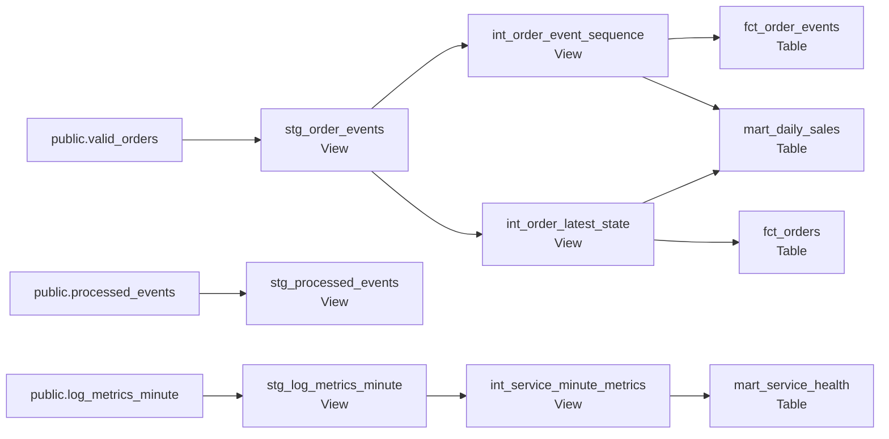
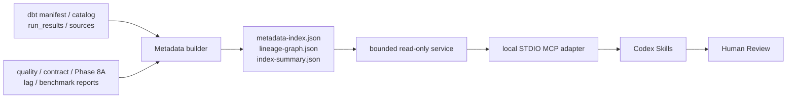
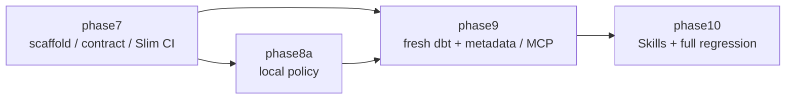

# Kafka、dbt、Metadata 與 MCP 架構 — Phase 6～10

本文件說明 Data Platform mandatory local mainline 的 as-built architecture。Phase 6～10 建立在既有
Kafka Core 之上，不改變 Topic、Consumer Group、offset commit、retry、DLQ、transaction 或 idempotency
語意。整體是作品集與參考實作，不是 production deployment architecture。

## 從 Database 到 Relation 的層級

```text
PostgreSQL server
└── Database: streaming
    ├── Schema: public
    │   ├── Table: valid_orders
    │   ├── Table: processed_events
    │   └── Table: log_metrics_minute
    ├── Schema: analytics_local_staging
    │   └── Views: stg_*
    ├── Schema: analytics_local_intermediate
    │   └── Views: int_*
    └── Schema: analytics_local_marts
        └── Tables: fct_* / mart_*
```

`streaming` 是 PostgreSQL Database；Schema 是 Database 內的 namespace；Table 與 View 都是 Schema
內的 relation。Kafka Consumers 擁有 `public` 三張 source tables 的寫入權責。Data Platform 只讀取
這些來源，dbt 不會把 model 寫回 `public`，也不會 truncate 或改動 source rows／idempotency markers。

PostgreSQL 不保存 raw application-log rows。`public.log_metrics_minute` 已是每分鐘 × service × endpoint
的聚合，因此後續模型不能提供 request ID、client IP、HTTP method 或個別 latency distribution。

## dbt target schema 如何變成實際 Schema

`dbt/profiles.yml.example` 的 local target 預設：

```text
database = streaming
target schema = analytics_local
```

`dbt/dbt_project.yml` 再對各 model directory 設定 custom schema：

| dbt layer | custom schema | local 實際 Schema | Materialization |
|---|---|---|---|
| staging | `staging` | `analytics_local_staging` | View |
| intermediate | `intermediate` | `analytics_local_intermediate` | View |
| marts | `marts` | `analytics_local_marts` | Table |

dbt-postgres 的預設 schema naming 會將 target schema 與 custom schema 以底線組合。CI target 必須由
`DBT_TARGET_SCHEMA` 提供獨立名稱；例如 Phase 9 使用 `analytics_ci_phase9`，對應的 marts schema 是
`analytics_ci_phase9_marts`。Credentials 全由環境變數提供；開發者將範例複製到 ignored
`dbt/profiles.yml`，不得 commit password 或完整 connection string。

## 分層責任與 Materialization



- **staging**：rename、cast、UTC／日期標準化，保留 source grain，不定義跨來源 business metrics。
- **intermediate**：放置訂單 stream sequence、latest known state、rate 等可重用邏輯。
- **marts**：提供有 Contract、grain、owner、SLO、docs 與 tests 的 published data products。

View 儲存 SQL 定義，查詢時由最新來源計算；Table 儲存最近一次 build 的結果。這個專案用 View
承載較輕、便於檢查的清洗／共用邏輯，用 Table 支援 marts 的重複分析查詢。這是目前資料量與用途的
選擇，不表示 View 不消耗資源，也不保證 Table 在所有查詢都較快。

新 Kafka 資料由 Consumer 寫入 `public` 後，查詢 staging／intermediate Views 可以反映來源變化；四個
mart Tables 不會自動更新，必須重新執行 `make dbt-build`。`make dbt-source-freshness` 檢查 source
recency；`make dbt-docs` 重新產生 manifest、catalog 等 artifacts。

## Phase 7：Developer Paved Road 與 Slim CI

```text
draft scaffold → dbt parse → convention validation → contract comparison
                                                     → state:modified+ build
base revision → isolated base schemas → manifest ────^       └─ defer upstream
```

Scaffold 只產生帶 `BLOCKING_TODO` 的 draft，不猜 source columns 或 business semantics。Slim CI 將 base
revision 以 read-only `git archive` 放到 temporary directory，在 run-specific `analytics_ci_base_*` schema
build；current selection 使用不同的 `analytics_ci_current_*` schema，未選 dependencies 透過 dbt defer
解析。Cleanup 只允許自己的 run-specific prefixes，永遠不匹配 `public`。

若 base revision 無法解析，runner 明確記錄 `full_ci_fallback` 並完整 build current project，不會靜默跳過。
State 與 diagnostics 寫到 ignored `dbt/target/` 和 `reports/data-quality/`。

## Phase 8A：本機 BigQuery compatibility／policy path

Phase 8A 從 fresh dbt manifest 與固定 SQL／cost fixtures 驗證 published-model metadata、partition filter、
bounded query 與 cost policies，並以純 Python orchestration contract 驗證 quality-gate failure propagation。
Evidence 只有 `static_validation` 或 `simulated`。這條 path 沒有 BigQuery adapter、GCP credentials、
Billing、Cloud Composer 或 production scheduler；Phase 8B 未執行，Phase 8C deferred。

## Phase 9：Metadata Index 與唯讀 MCP



Metadata builder 將固定 dbt artifacts 與 allowlisted reports 正規化為每個 dbt model／source 一筆的 asset
index、直接 lineage edges 與 evidence identities。它不保存 report payload 或 raw business rows。
`manifest.json` 缺少時 build 失敗；其他可選 evidence 缺少時產生明確 degraded index。

MCP 只提供 `search_data_assets`、`get_model_schema`、`get_model_owner`、`get_lineage`、
`get_upstream_lineage`、`get_downstream_impact`、`get_quality_status`、`get_recent_pipeline_failures`、
`get_consumer_lag` 與 `get_cost_estimate`。Readers 只接受固定路徑／pattern，單檔上限 8 MiB；tool input、
lineage depth／nodes、response size 與 timeout 都有 bounds。它不執行 SQL、shell、live Kafka query、pipeline
rerun、offset reset、schema mutation 或任意 filesystem read／write。唯一寫入是 server-internal sanitized
audit：`reports/metadata/mcp-audit.jsonl`，並不是 MCP file-write tool。

## Phase 10：Codex Skills 與 Human Review

三個 repository-local Skills 使用 deterministic helpers 與 Phase 9 restricted STDIO adapter：

- `dbt-scaffold` 先查已驗證 schema，再在明確 project root 原子產生 model、Contract／docs 與 unit-test draft。
- `dbt-pr-review` 以固定規則檢查 Contract、convention、SQL risk、cost 與 lineage impact。
- `incident-diagnosis` 關聯 freshness、quality、pipeline、lag 與 cost evidence，區分 facts、inferences、
  unknowns 與 rejected hypotheses。

Skills 不具 deploy、merge、pipeline rerun、backfill、offset reset、schema／IAM mutation 或 cloud-resource
creation interface。輸出的 remediation／backfill／validation commands 只是供人 review 的文字，從不自動執行。

## GitHub Actions：乾淨環境重建



每個 Job 是新的 GitHub runner，不能讀取本機 Docker volumes 或 ignored artifacts。Phase 7、9、10 依各自
需求建立 PostgreSQL service、啟動 Kafka、執行 migrations／fixtures 並產生 fresh evidence；Phase 8A
只需本機 policy／orchestration validation。Workflow 會上傳 run-specific allowlisted diagnostics，並在同一
Git ref 有新 run 時取消舊 run。這是 CI acceptance evidence，不是 production deployment。

## 關鍵邊界

- Kafka → PostgreSQL 是 at-least-once + idempotency，不是 distributed exactly-once。
- Data Platform 不修改 `public` source ownership 或 Kafka Core reliability semantics。
- Materialization 全為 View／Table；目前沒有 PostgreSQL incremental model 或 streaming dbt。
- BigQuery runtime、Sandbox observation、Billing-enabled load／`MERGE`／incremental 與 Cloud Composer 未完成。
- Metadata 是 artifact-based，不是 live enterprise observability。
- AI 建議與診斷停在 Human Review，沒有 autonomous production mutation。
